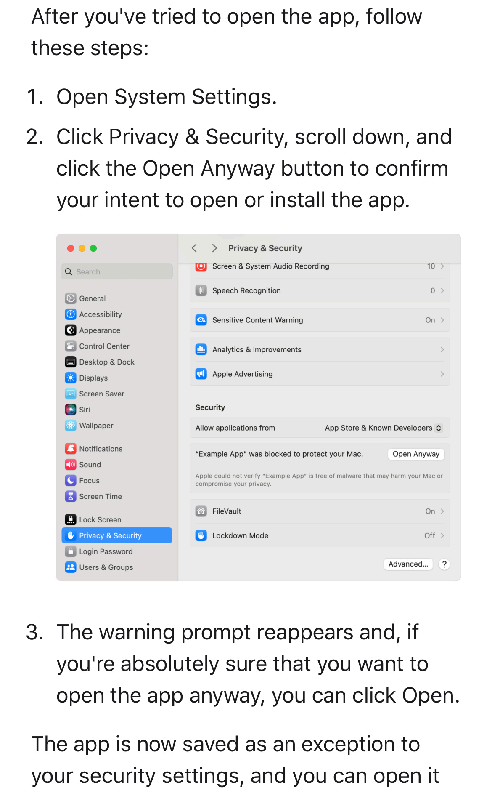
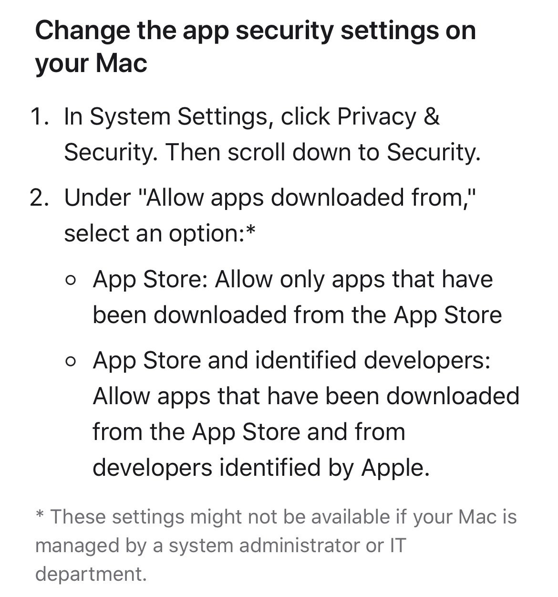

# Dice Adventure Human-Machine Teaming Challenge
Welcome! This repository contains skeleton code to develop and train agents to play Dice Adventure (DA), developed 
at Carnegie Mellon University and Georgia Institute of Technology. This README describes how to use the code. Please review the [changelog](https://github.com/STRONG-TACT/Dice-Adventure-Agents/blob/main/changelog.md) for any updates made to the code files.

- [Dice Adventure Documentation](#dice-adventure-documentation)

- [Code Overview](#code-overview)
  - [Game State](#game-state)
  - [Getting Started](#getting-started)
  - [Develop your agents](#develop-your-agents)
  - [Code Submission](#code-submission)


## Dice Adventure Documentation
Dice Adventure is a 3D, turn-based, dungeon crawler game created at Carnegie Mellon University by [Dr. Erik Harpstead's](http://www.erikharpstead.net/) 
game design team in support of an Army Research Lab project on human-machine teaming (HMT). [Dr. Christopher MacLellan's](https://chrismaclellan.com/) 
Teachable AI Lab (TAIL) at the Georgia Institute of Technology supports the artificial intelligence development aspect 
of the project. DA was designed to explore paradigms in HMT. 

You can find a complete game documentation on the [competition portal](https://strong-tact.github.io/).

## Code Overview
This repository provides five main files for you to develop and submit your agents. You can find these in the `agent_template/` and `game/` folders: 

- `agent.py`: A `DiceAdventureAgent` template class that you will use to implement your agent;
- `dice_adventure_gym_env.py`: An OpenAI Gym interface that lets you connect to the Dice Adventure Unity game and develop RL agents or other agent types;
- `submission_info.json`: A submission JSON file that requests basic information about your submission;
- ``: A Windows local build of Dice Adventure; and
- ``: A Mac local build of Dice Adventure (see [Troubleshooting](#troubleshooting) if you're using this build)

*Note: We tested this code in Python 3.9.0. Please see the end of this README for full list of software versions.*

### Game State

`game/example_state.json` contains an example of what a game state might look like. 

Each game object is represented as a Python dictionary. Note that this state shows you a full
snapshot of the level, but your agents will receive a state with less information due to the fog-of-war mechanic that initially hides much of the map. As more of the map is explored, more
information is revealed in the state. This file will be useful to help you determine the values that game object attributes can take.

### Getting Started

1. Install the required packages using the requirements.txt file in order for your agent to run: `pip install -r requirements.txt`
2. Start an instance of Dice Adventure by double clicking on the correct executable for your
operating system.

You will be asked to accept a consent form. Choose the following options: <br>
- I Agree <br>
- Play as Anonymous <br>
- Start <br>
- Practice Mode <br>

3. In the `examples/random_agent/` folder, there is a sample agent that plays as all three characters in the game and simply 
takes random actions. 

```sh
  python play_game.py
```

The sample code is commented and can be used as a reference structure for training/testing agents. 

4. To speed up testing, you can run the game executable from your terminal and supply an optional
parameter `-stepTime <value>` where <value> is some value between 0-1. 0 is an 'instant mode' that
makes animations and splash screens occur instantly in the game, while 1 is 'normal mode'.

5. See the troubleshooting guide at the end of this assignment if you run into trouble.

### Develop your agents
We provide template code in the `agent_template/` folder. You should implement your agents within the `DiceAdventureAgent`
class provided in the `agent.py` file. This allows us to maintain a common API interface for all submitted agents.

The `init()` function should load in your agent using a relative filepath (if it needs to be loaded) and the `take_action()`
function should return an action to take in the game given the current game state and a list of game actions. Note that 
the return should be an option from the list of game actions, so if, for instance, your model enumerates the actions with
numbers, the conversion to a string should happen before the action is returned.

A custom Gymnasium environment ([good reference](https://blog.paperspace.com/creating-custom-environments-openai-gym/)) 
has been provided for convenience in the file `dice_adventure_gym_env.py`. This environment interfaces with the Unity game and can be used to avoid setting up your own connection to the game.
No matter the type of agent you develop, you can add additional functions to the environment as needed to support training.
Each function is documented in the file.

### Code Submission
Agents should be submitted on the [competition portal](https://strong-tact.github.io) before the deadline. 
In your submission, please include a zipped folder containing:
  - your `agent.py` file containing your agent implemented in the `DiceAdventureAgent` class
  - your `dice_adventure_gym_env.py` file
  - the `submission_info.json` file containing your name and your agent's name
  - a `requirements.txt` file containing any packages your model needs to run
  - any other model files needed to load in your agent

### Troubleshooting

**Game Executable File**: You're running MacOS and your executable file will not open.

MacOS builds require a couple extra steps the first time you download the game executable file. 
- Unzip the MacOS executable: DiceAdventure_MacOS_Build.app.zip
- In a terminal, run the following command: `chmod -R +x DiceAdventure_MacOS_Build.app`
- Then, you should be able to right-click and open the file (double-clicking may not work)
- Alternatively, to run in the terminal, you can use: `open -n ./DiceAdventure_MacOS_Build.app --args -
stepTime 0.5`

If you still cannot open the file after following the above steps, try one of the following solutions:

(1) 

(2) 


### Contact Information
Please contact any of us if you have any questions or run into any issues!

| Name       | Position    | Contact              | 
|------------|-------------|----------------------|
| Qiao Zhang | PhD Student | qz99(at)gatech.edu |

### Versions
| Tool/Software  | Version |
|----------------|---------|
| Python         | 3.9.0   |
| Unity Hub      | 3.5.1   |
| Unity Editor   | 2020.3.32f1 |

